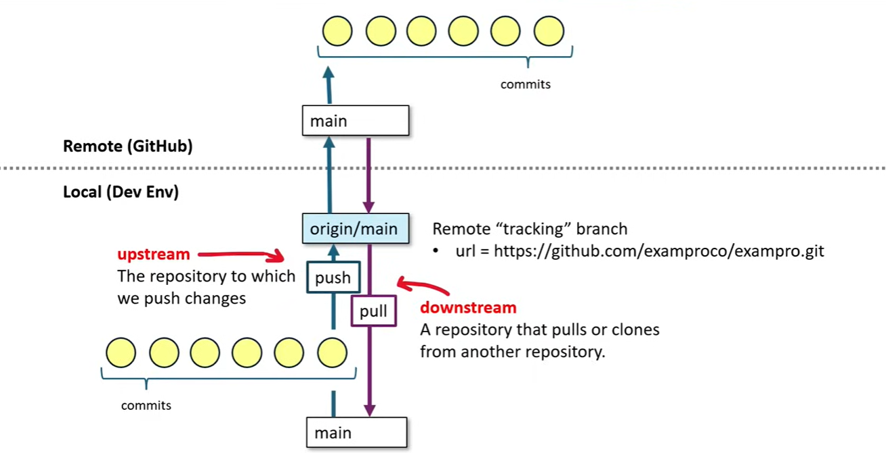

Press period in your repo to open up web gui codebases.

-> use source control menu in the left panel to see changes. add them to staged changes while commiting just for them. all otherwise.
## Memo
```sh
git add .
git commit -m "commit memo"
git push
```

## Testing SH(ell)
```sh
test of markdown writing style ->  press altgr and comma on keyboard to write backticks. 3 backticks open markdown container
```

## Temp Folder Creation
```sh
cd ..
mkdir tmp
git clone https://github.com/idincern/GithubFoundationsTraining.git
cd GithubFoundationsTraining/
ls -la # to see hidden files in the folder. there is a .git folder in our ws which means that it is a git repo.
```

To initialize a git repo, type
```sh
git init
```

Type ``git status`` to see the git repo and staged changes.
type ``git add .`` to add all changes to staged. Otherwise, write name of the file to add them to the staged changes. If any error occurs, you can reset changes added to the staged changes by using ``git reset``.

To remove git repo(git folder): ``rm -rf .git``

```sh
git commit -m "Add commit message" #To add a commmit to the staged changes
```

```sh
git log # shows recent commits to the git tree
```

## .gitconfig file
To see the .gitconfig file, type:

```sh
git config --list
```

In the setup stage of git, we must define the global username and email to use the git.
you can set the username and email via:

```sh
git config --global user.name "John Doe"
git config --global user.email johndoe@example.com
```

## Opened github repo in local computer
Open test OK


## Branching
```sh
git branch #shows all branches
git branch dev #creates a new branch named dev
git checkout dev #changes branch to the dev => first time => git push -u origin dev
# added git graph extension to the local vscode
```

## Merging
```sh
git checkout dev
git merge main #merges dev with main-> Makes main up to date. Resolve any conflicts with the main first if there is any.
```

## Stashing
Stashing to move staged - unstaged changes in another location => 
Beware of this in cloud dev. env. because data may be lost.
```sh
git stash list #shows stashes
git stash #stashes all staged changes
git stash save my-stash-name #stashes all staged changes with the my-stash-name name
git stash apply #instead of popping it directly applies stashes
git stash pop #brings out the stashed changes
```

## Committing
Addition, modification and deletion of files/file contents.
It doesn't show the whole file, only its changes.
Each commit has its own specific SHA hash ID, which can be checked out to.
```sh
#Components of Git Commit:
[*] Commit Hash: A unique SHA-1 hash identifier for the commit.
[*] Author Info: Name and e-mail.
[*] Commit Message: A description of what changes the commit contains.
[*] Timestamp: D/T of the commit
[*] Parent Commit Hash(es)
[*] Snapshot of the Content
```

```sh
git add my-file
git add. # Add all files
git rm my-other file # Remove a specific file

git commit -m "Commit message" # Commits staged changes with a message

git commit -a -m "Commit message" # Automatically stages all tracked, modified files before the commit 

git commit --amend #Modifies the most recent commit 

git commit -m "Initial commit" --allow-empty #Creates an empty commit, useful as a placeholder

git commit -m "Message" --author="Author Name <email@example.com>" #Commits with a specified author.

661a91ad3b66926c4591f9d3c73c087906945f3b #Checkout to a specific commit based on SHA hash git checkout 
```

## Branching
A git branch is a divergence of the state of the repo.

Branch = Copies of a point in time that have been modified to be different.

Usually there are ``main branch`` and ``production branch``. Development is done in the main branch and sub-main ``feature branch(es)`` and than pushed out to the production branch when ready.


```sh
git branch #Lists all local branches 
git branch [branch-name] #Creates a new branch 
git checkout [branch-name] # Checkout (switch to) a branch 
git checkout -b [branch name] # Create and checkout a branch 
git branch -d [branch-name] #Deletes a branch
git branch -m [old-name] [new-name] # Renames a branch
git branch -a # Lists both remote and local branches 
```

#### Branch Memo
```sh
git checkout -b my-new-branch 
#(...)relevant changes to the files
git add .
git commit -m "my relevant changes"
git push -u origin my-new-branch
```
Note: Video time: 2:48:00

## Remote
A git remote represents ``the reference to remote location`` where a copy of a repo is hosted.
``origin`` is mostly the reference remote name that everone uses. 
Remote entries are stored in ``.git/config``
```sh
git push [remote-name] [branch] #pushes a branch and its commits to the specific remote
git pull [remote-name] [branch] #pulls update from a remote branch.
git fetch [remote-name] #fetch updates without pulling
```
